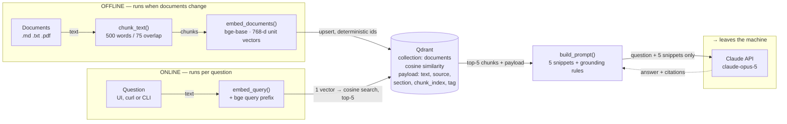

# How it works

What the system does when you ask it a question, which component owns which
part of the answer, and how to answer the hard questions about it.

Numbers throughout are measured against the sample corpus in
[`documents/sample/`](../documents/sample/), not estimated.

---

## The one-sentence version

**It's a search engine that hands its results to Claude instead of to you.**

Claude has never read your documents. You can't paste all of them into a prompt,
and if you could, you'd pay for every token on every question. So the system
keeps its own searchable copy, finds the five passages most relevant to whatever
you asked, and sends *only those* to Claude along with the question and an
instruction to answer from them alone.

That's retrieval-augmented generation. The "retrieval" is a real search problem
and it's where nearly all the quality lives. The "generation" is one API call at
the end.

---

## The two pipelines

The most important structural fact: there are **two separate programs**, and they
share exactly one thing — the Qdrant collection. Ingestion runs when documents
change. Query runs when someone asks something. Merging them is the classic
beginner mistake.



Both pipelines meet only at the collection. Chunking, embedding, storage and
search all happen on the box; the single arrow that crosses into `remote`
carries the question plus five retrieved passages — never the corpus.

---

## Follow one document in

What `homebrew-rag ingest` actually does. Against the sample corpus this turns
3 files into 7 rows in a database.

**1. Read the file to plain text** — `ingest.py · load_file_text()`

Markdown and text are read as-is; PDFs go through `pypdf` page by page. A scanned
PDF yields nothing extractable and is *reported as skipped* rather than indexed
as blank. A silent empty chunk is worse than a loud skip.

**2. Split on headings, then into overlapping windows** — `chunking.py · chunk_text()`

The document is cut at markdown headings first, so a chunk is one coherent idea
rather than an arbitrary slice. Long sections are then windowed at 500 words with
75 words of overlap, so a sentence spanning a boundary still appears whole in one
of them. Every chunk carries its heading at the top — that heading is both
retrieval signal and what lets a citation name a *section*, not just a file.

**3. Turn each chunk into 768 numbers** — `embeddings.py · LocalEmbedder.embed_documents()`

The embedding model reads a chunk and emits a vector: a point in 768-dimensional
space positioned so that passages about similar things land near each other. This
is what makes search work on meaning rather than keywords. It runs on CPU, on
your box, with no network call.

**4. Write it to Qdrant with its metadata** — `store.py · QdrantStore.upsert_chunks()`

Each chunk becomes a *point*. The old points for that document are deleted first,
so re-ingesting updates the index rather than duplicating it.

### One real point

This is the unit the whole system operates on. Everything else is machinery for
producing these and finding them again.

```jsonc
// GET /collections/documents/points/scroll
{
  "id":     "04c6d559-fc67-5f9b-b89f-7b66e057788c",
  "vector": [0.0175, 0.0070, 0.0248, ...],   // 768 floats, length exactly 1.0
  "payload": {
    "text":        "## Confidentiality\n\nClient materials are held in
                    confidence for three years following the end of...",
    "source":      "engagement-terms.md",    // what a citation names
    "section":     "## Confidentiality",
    "chunk_index": 4,
    "source_tag":  "demo"                    // the filter key: services / agreements / ...
  }
}
```

---

## Follow one question through

Timings are from the live system answering *"What does the audit cost?"*

**1. The question becomes a vector too** — `pipeline.py · retrieve()`

Same model, same 768 dimensions. That's the whole trick: a question and the
passage that answers it land near each other in that space, so "find the answer"
becomes "find the nearest points."

**2. Qdrant returns the five nearest chunks** — `store.py · search()` · ~38 ms

Cosine similarity, ranked. For this question the top hit scored **0.712** (the
pricing section) and the fifth scored 0.386. The spread between them is the
signal that retrieval found something specific rather than shrugging. If a
`source_tag` is supplied, the search is restricted to that corpus before ranking.

**3. The chunks are pasted into a prompt with rules** — `generation.py · build_prompt()`

Each chunk goes in labelled with its filename and section, wrapped in `<context>`
tags, followed by the question. The system prompt does three jobs: use only this
context, say plainly when it isn't enough, cite the file for every claim.

**4. Claude writes the answer** — `generation.py · ClaudeGenerator.generate()` · ~2.6 s

One API call. The only moment anything leaves the machine, and what leaves is the
question plus those five passages.

**5. Answer plus receipts come back** — `pipeline.py · RagResult`

The response carries the answer, the five sources with scores and text previews,
per-stage timings, and token usage. The sources matter as much as the answer:
they're how you check the thing rather than trust it. Every request is logged
with its retrieved sources.

---

## Which file owns which decision

Each module exists because it holds exactly one decision you might later want to
change.

| Module | Lines | Its job | The decision inside it | What goes wrong if that's wrong |
|---|--:|---|---|---|
| [`chunking.py`](../src/homebrew_rag/chunking.py) | 98 | Cut documents into indexable pieces | Where to cut, how much to overlap | Too small loses context, too large dilutes relevance. Most retrieval failures start here. |
| [`embeddings.py`](../src/homebrew_rag/embeddings.py) | 115 | Turn text into vectors | Which model; local vs. hosted | Nothing else knows what an embedding is — this is the seam where a Voyage or OpenAI backend drops in. |
| [`store.py`](../src/homebrew_rag/store.py) | 242 | Own the Qdrant collection | Point IDs, stale-chunk deletion, filters | Wrong IDs duplicate the index on re-ingest; no deletion means citing text you removed. |
| [`generation.py`](../src/homebrew_rag/generation.py) | 175 | Ask Claude, safely | The grounding rules in the system prompt | Without explicit licence to say "I don't know", the model answers from general knowledge — defeating the point. |
| [`pipeline.py`](../src/homebrew_rag/pipeline.py) | 133 | Wire embed → search → generate | What happens when nothing is retrieved | Short-circuits rather than paying for a call with empty context. |
| [`ingest.py`](../src/homebrew_rag/ingest.py) | 120 | The offline run | Batching, per-document cleanup | Runs independently of the API — you can re-index while the service keeps answering. |
| [`evaluation.py`](../src/homebrew_rag/evaluation.py) | 111 | Score retrieval against known answers | Recall@k and MRR, no LLM involved | Without it you have opinions about quality instead of measurements. |
| [`api.py`](../src/homebrew_rag/api.py) | 165 | Serve HTTP and the web UI | Optional API key, request logging | Auth is off until `RAG_API_KEY` is set — the firewall controls reachability, not permission. |
| [`config.py`](../src/homebrew_rag/config.py) | 116 | One home for every tunable | Defaults, and rejecting bad combinations | Overlap ≥ chunk size would loop forever; it refuses at startup instead. |
| [`cli.py`](../src/homebrew_rag/cli.py) | 200 | The commands you type | ingest / query / eval / stats / serve | Every operation is scriptable, so re-ingest can be a cron job. |

---

## Where quality actually comes from

If an answer is bad, it is almost never the model's fault. Work down this list.

**1. Chunking.** The highest-leverage setting and the one people underinvest in.
A chunk is the unit of retrieval — if the answer is split across two chunks, no
amount of model quality recovers it. Change `RAG_CHUNK_SIZE` / `RAG_CHUNK_OVERLAP`,
re-ingest, re-run the eval.

**2. What you retrieve, and how much.** `top_k` trades recall against noise: more
chunks mean the right passage is likelier to be there, and also that it competes
with more irrelevant ones for attention. Five is a sane default. Filtering by
`source_tag` — searching only the agreements when you know the answer is in an
agreement — buys precision that no amount of tuning does.

**3. The grounding instruction.** Three sentences in the system prompt do the
heavy lifting: answer only from context, say when it's insufficient, cite the
file. Remove the permission to say "I don't know" and the model helpfully fills
gaps from general knowledge — hallucination reintroduced through the front door.

**4. Keeping the index honest.** An index that confidently cites last year's
pricing is worse than no index, because it's believed. Re-ingest when sources
change; the system is built so that's safe at any time.

> **An honest caveat about scores.** Cosine scores have no absolute meaning —
> they're comparable only within one model and one prompting scheme. Measured on
> this corpus, adding the bge query prefix moved the top score for "What does the
> audit cost?" from 0.745 to 0.712 while leaving the *ranking identical*. The
> prefix is what the model card specifies and matters more as a corpus grows, but
> on seven chunks it changes calibration, not order. That is exactly why
> `RAG_SCORE_THRESHOLD` is unset by default: a hardcoded cutoff silently breaks
> the day you change models.

---

## Where the data goes

Ingestion is entirely local: reading files, chunking, embedding and writing to
Qdrant all happen on the box, with no network call at any step. Retrieval is
local too — searching the index is a database query.

One request per question leaves the machine, to Anthropic, containing the
question and the top five retrieved passages. Not the corpus, not the index, not
the documents that weren't retrieved. Fifty questions means fifty small requests;
the documents themselves never go out.

That is a materially smaller exposure surface than a pipeline calling a hosted
embedding API, which by construction ships every chunk of every document to a
third party at index time.

> **What is *not* protected yet.** The firewall rule limits which machines can
> reach port 8000; it authenticates nobody. Until `RAG_API_KEY` is set, anyone on
> the LAN can query the index. Fine while the corpus is your own material, a
> blocker the moment it isn't.

---

## Vocabulary

| Term | Meaning |
|---|---|
| **Embedding** | A list of numbers representing a piece of text's meaning, positioned so similar meanings sit close together. Here, 768 numbers per chunk. |
| **Vector database** | A database whose primary query is "what's nearest to this point?" rather than "what matches this value?" Qdrant is ours. |
| **Cosine similarity** | The measure of nearness — the angle between two vectors, 1.0 being identical direction. Vectors are normalized to length 1, so it compares direction alone. |
| **Chunk** | The unit of retrieval: a passage small enough to be specific, large enough to stand alone. ~500 words here. |
| **Payload** | Metadata stored alongside each vector — text, filename, section, corpus tag. What makes citation and filtering possible. |
| **top-k** | How many chunks to retrieve per question. Five. |
| **Recall@5** | Of questions where you know which document holds the answer, the fraction where it appeared in the top five. Currently 6/6 on the sample set. |
| **MRR** | Mean reciprocal rank — credits being *first*, not merely present. 1.000 means the right document ranked first every time. |
| **Grounding** | Constraining the model to answer from supplied text rather than its training. The entire point. |
| **Idempotent ingest** | Running the same ingest twice produces the same index, not two copies. Achieved with deterministic point IDs. |

---

## Questions you'll get

**Why not just paste the documents into Claude's context window?**

For a handful of documents, you should — it's simpler and it works. RAG earns its
keep when the corpus outgrows the window, when you're paying per token on every
question, or when you want the answer to name its source. The retrieval step is
also a filter: five relevant passages often produce a sharper answer than fifty
pages of mostly-irrelevant context.

**How do you know the answers are accurate?**

Two separate mechanisms, worth keeping distinct. Retrieval accuracy is
*measured*: the golden set pairs questions with the document that should answer
each, and `homebrew-rag eval` scores it — currently 6/6 at rank 1. Answer
accuracy is *constrained but not proven*: the prompt requires citation and
permits "I don't know", and every response returns its sources so you can check.
Citation is enforced by instruction, not by code — verifying that cited files
actually appear in the retrieved set is a known next step.

**What does it cost to run?**

Embedding is free — local CPU. Storage is a Docker volume. The recurring cost is
one Claude call per question, and the input is small by construction: a question
plus five passages, not the corpus. Ingesting more documents costs nothing, and
neither does running the evaluation suite, which is why retrieval tuning is cheap
to iterate on.

**What happens when a document changes?**

Re-run ingest. Each document's existing chunks are deleted before new ones are
written, and point IDs derive from the document and chunk position rather than
randomly — so editing a file updates it in place, and shortening one drops the
chunks that no longer exist. Nothing accumulates. The open question isn't safety,
it's scheduling: cron it, or hook it to file changes, so the index can't go stale
silently.

**Could this hold a client's documents rather than mine?**

Architecturally yes, and isolation has two levels. `source_tag` filtering keeps
corpora logically separate in one collection; a separate Qdrant collection per
client is the stronger boundary. Either way three things become mandatory first:
`RAG_API_KEY`, TLS if it's reachable beyond the LAN, and a decision about whether
the client's data-handling terms permit the one outbound call to Anthropic.

**Where does it break down?**

Four known edges, worth naming before someone finds them for you. Scanned PDFs
produce no text and are skipped — they need OCR first. Pure vector search can
miss exact-term lookups like a specific dollar figure or clause number, which is
what hybrid search with BM25 exists to fix. Follow-up questions embed badly on
their own: "what about the second option?" means nothing without rewriting it
into a standalone query. And an answer spanning many documents is harder than one
living in a single passage, because top-5 may not assemble the full picture.

**Why no LangChain?**

At this size the framework is more code than the pipeline. The whole system is
1,513 lines and every step is visible — when retrieval returns something odd you
read four functions rather than trace an abstraction. Frameworks pay off with
many integrations and swappable backends; the seams here (embeddings, store and
generation each sit behind a small interface) already allow the swaps that matter.

---

## What's running on the box

| Part | What it is | Where its state lives | Check it |
|---|---|---|---|
| `qdrant` | Docker container, ports 6333 (HTTP) / 6334 (gRPC) | `qdrant_storage` volume — this is the index | `curl localhost:6333/readyz` |
| `rag-api` | uvicorn serving FastAPI on :8000, under systemd or Docker | Stateless — safe to restart any time | `curl localhost:8000/health` |
| embedding model | ~440 MB of weights loaded into the API process at startup | `~/.cache/huggingface` — downloaded once | `homebrew-rag stats` |
| `.env` | The Anthropic key and every tunable | On disk, gitignored, `chmod 600` | `make check` |

Two things to back up, different in kind: the `qdrant_storage` volume is the
index, and the source documents are what the index is derived from. Keep the
documents and you can always rebuild the index; keep only the index and you can't
recover what built it.
